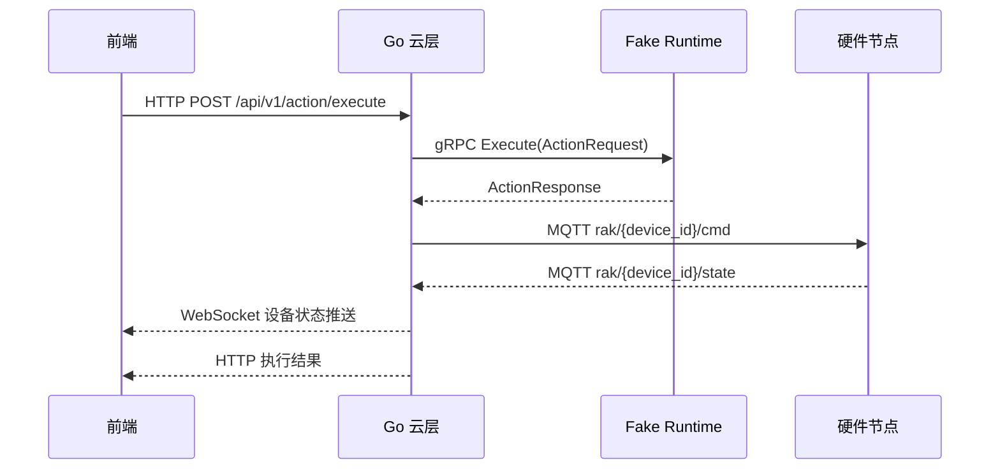

# Rak 技术框架

## 文档状态

- 状态：Draft v0
- 目标：为 2 周 MVP 提供统一架构入口、角色边界、协议冻结点和文档索引
- 适用范围：前端、Go 云层、AI Runtime、硬件联调

## 一句话定义

Rak 的两周 MVP 不是完整的具身智能系统，而是先打通一条稳定的设备控制闭环：

前端发起动作请求 → Go 云层接收与调度 → Fake Runtime 决策与转译 → MQTT 下发硬件 → 硬件回传状态 → 前端收到实时结果

## MVP 目标

### 本轮要完成

- 建立唯一正式文档入口
- 冻结 HTTP WebSocket gRPC MQTT OTA 的最小协议分工
- 冻结 RakMessage 统一消息模型
- 明确前端、Go、Runtime、硬件四个角色的 owner 边界
- 形成可直接联调的控制流和接口口径

### 本轮不展开

- 完整技能市场与审核流程
- 完整 NTR、记忆系统、LoRA 技能系统
- 完整数据库与分析平台
- 生产级安全、合规、监控体系
- 多业务场景同时推进

## MVP 固定决策

| 项目 | 决策 |
| --- | --- |
| 主场景 | 设备控制闭环 |
| 前端到 Go | HTTP + WebSocket |
| Go 到 Runtime | gRPC |
| Go 或 Runtime 到硬件 | MQTT |
| OTA | HTTP |
| 统一消息模型 | RakMessage v0 |
| Runtime 级别 | Fake Runtime |
| 文档形态 | 主文档 + 分文档 |

## 系统分层

### 1. 前端层

- 负责人：你
- 职责：发起动作请求、展示设备状态、接收实时回传、提供最小操作界面
- 输入：用户操作、设备状态推送
- 输出：标准 HTTP 请求、WebSocket 订阅处理

### 2. Go 云层

- 负责人：Go 云架构师
- 职责：统一 API 入口、调用 Runtime、转发 MQTT、汇总状态、向前端推送结果
- 输入：前端动作请求、设备状态消息
- 输出：gRPC 调用、MQTT 指令、WebSocket 推送、HTTP 响应

### 3. Runtime 层

- 负责人：AI 工程架构师
- 职责：接收状态与可选动作，返回动作决策或参数转译结果
- 输入：Go 发来的执行请求
- 输出：标准化动作结果
- 说明：MVP 使用 Fake Runtime，不要求完整 AI 能力

### 4. 硬件层

- 负责人：硬件工程师
- 职责：订阅指令、执行动作、上报状态、接入 MQTT 云端
- 输入：MQTT 命令
- 输出：MQTT 状态、事件、心跳

## 控制流

## 模块边界

| 模块 | 只负责 | 不负责 |
| --- | --- | --- |
| 前端 | 发起动作与展示结果 | 设备协议细节、Runtime 策略 |
| Go 云层 | 协议转译、路由、聚合、推送 | 长期智能决策、硬件驱动实现 |
| Runtime | 动作选择与参数决策 | UI 展示、MQTT 连接管理 |
| 硬件 | 执行动作与回传状态 | 云层路由、复杂策略编排 |

## 本轮正式文档地图

- [RakMessage-v0](./docs/协议/RakMessage-v0.md)
- [云层统一接口-v0](./docs/接口/云层统一接口-v0.md)
- [Runtime-MVP边界](./docs/运行时/Runtime-MVP边界.md)
- [技术环境标准](./docs/标准/技术环境标准.md)
- [物联网接入标准](./docs/标准/物联网接入标准.md)
- [MVP两周对齐表](./docs/协作/MVP两周对齐表.md)
- [Front 文档](./front.md)
- [Go 文档](./go.md)
- [Runtime 文档](./runtime.md)
- [ESP 文档](./esp.md)
- [example 索引](./example/README.md)

## 按角色执行入口

- 前端负责人从 [front.md](./front.md) 进入，只看前端职责、任务和接口消费面
- Go 云架构师从 [go.md](./go.md) 进入，只看 API、gRPC、MQTT 和状态汇聚责任
- AI 工程架构师从 [runtime.md](./runtime.md) 进入，只看 Fake Runtime 边界和 gRPC 对接
- 硬件工程师从 [esp.md](./esp.md) 进入，只看设备执行、状态回传和 OTA 配合

## 两周节奏

### 第 1 周

- 冻结 RakMessage、HTTP、gRPC、MQTT 的字段与接口
- 明确 Runtime 边界和硬件接入规则
- 前端与 Go 先完成请求响应和状态回传约定

### 第 2 周

- 完成四角色联调
- 跑通一条动作执行与状态回传链路
- 用文档作为唯一验收基线

## 验收标准

- 四个角色都能从文档中找到自己的输入、输出和依赖
- 所有链路都使用同一套 RakMessage 字段语义
- 从前端到设备再回前端的控制流没有字段断裂和职责重叠
- 新成员进入项目后，可以先看本文件，再顺着索引进入对应专题文档
